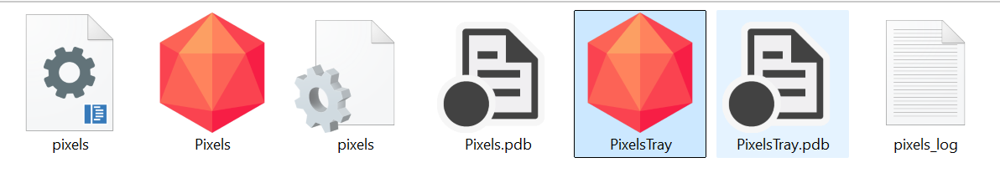
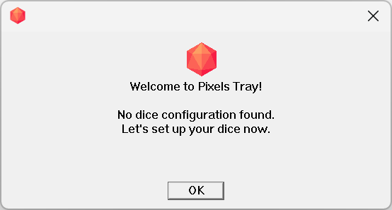
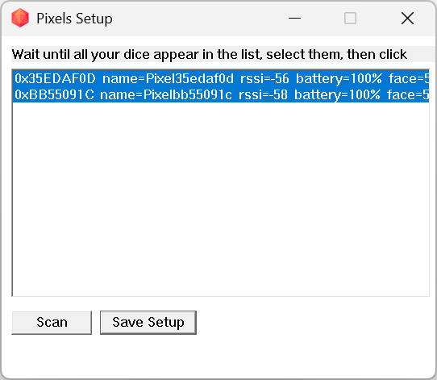
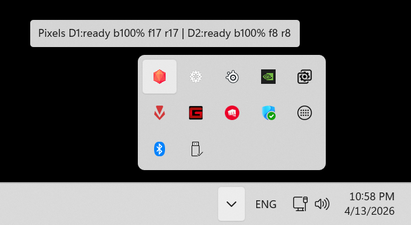
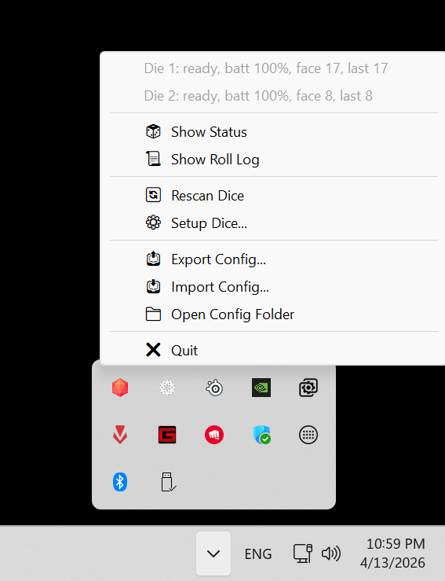
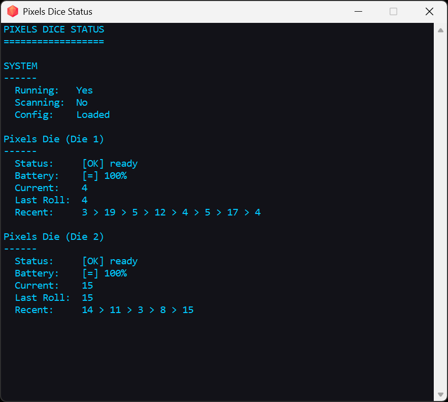
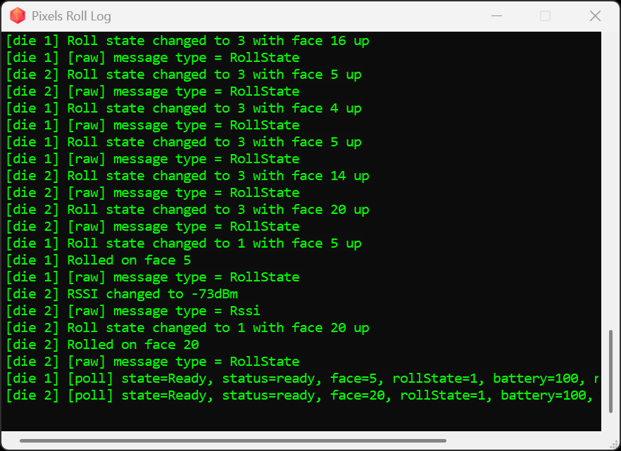
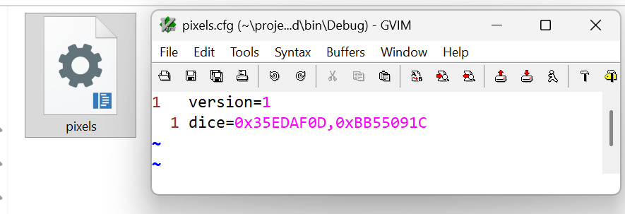
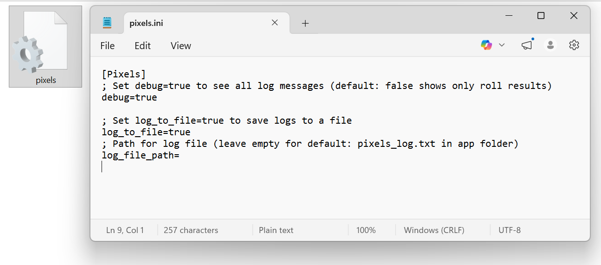

# C++ Pixels Dice Library For Windows

This is the C++ Pixels library for Windows.
Windows Runtime [WinRT](https://github.com/microsoft/cppwinrt) APIs are used
to access Bluetooth.

Windows 10 version 1709 (Fall Creators Update) or more recent is required.

## Foreword

Pixels are full of LEDs, smarts and no larger than regular dice, they can be
customized to light up when and how you desire.
Check our [website](https://gamewithpixels.com/) for more information.

> **Warning**
> Before jumping into programming please make sure to read our Pixels developer's
> [guide](https://github.com/GameWithPixels/.github/blob/main/doc/DevelopersGuide.md).

Please open a [ticket](https://github.com/GameWithPixels/PixelsWinCpp/issues)
on GitHub if you're having any issue.

## Overview

This project includes:

- **PixelsLib** — A static C++ library for communicating with Pixels dice over BLE.
- **Pixels** — A console application for scanning, configuring, and reading dice rolls.
- **PixelsTray** — A Windows system tray application that runs in the background, connects to your configured dice, and displays live roll results.

## Building

### Prerequisites

- **Windows 10** version 1709 or later
- **Visual Studio 2022** (or later) with the C++ Desktop workload
- **CMake** 3.20 or later
- **Windows 10 SDK** (10.0.17134.0 or later)

### Build Steps

1. Generate the build files:

   ```powershell
   cmake -B build -G "Visual Studio 17 2022"
   ```

2. Build all targets:

   ```powershell
   cmake --build build --config Debug
   ```

   Or build only the tray app:

   ```powershell
   cmake --build build --config Debug --target PixelsTray
   ```

3. The built executables are located in `build/bin/Debug/`:

   

   - **PixelsTray.exe** — The tray application
   - **Pixels.exe** — The console application

## PixelsTray (Tray Application)

PixelsTray is a Windows system tray application that connects to your Pixels dice and displays live roll results in the background.

### First Launch

On first launch, if no dice configuration is found, a welcome dialog will guide you through setup:



Click **OK** to open the setup window where you can scan for and select your dice.

### Dice Setup

The setup window scans for nearby Pixels dice. Wait for your dice to appear, select them, and click **Save Setup**:



This saves the selected dice IDs to `pixels.cfg` in the application directory.

### Tray Icon

Once running, PixelsTray appears as an icon in the Windows system tray. Hover over it to see a quick summary of all dice:



The tooltip shows the connection status, battery level, current face, and last roll for each die.

### Tray Menu Actions

Right-click the tray icon to access the menu:



The top of the menu shows a live summary for each die. Available actions:

- **Show Status** — Opens the Dice Status window
- **Show Roll Log** — Opens the live log window
- **Rescan Dice** — Restarts the BLE scanner to rediscover dice
- **Setup Dice...** — Opens the dice setup window to reconfigure your dice
- **Export Config...** — Save your current configuration to a file
- **Import Config...** — Load a configuration from a file
- **Open Config Folder** — Opens the folder containing the configuration files
- **Quit** — Disconnect all dice and exit the application

### Dice Status Window

The status window provides a detailed live view of all connected dice:



For each die it shows:

- **Status** — Connection state (`ready`, `connecting`, `disconnected`)
- **Battery** — Current battery level
- **Current** — The face currently showing on the die
- **Last Roll** — The last recorded roll result
- **Recent** — History of recent roll results

### Roll Log Window

The log window shows a live stream of all BLE events, roll state changes, and diagnostic messages:



This is useful for debugging connectivity issues or verifying that rolls are being detected correctly.

## Configuration Files

PixelsTray uses two configuration files, both located in the application directory.

### pixels.cfg

Stores the selected dice IDs. Created automatically by the setup process:



```ini
version=1
dice=0x35EDAF0D,0xBB55091C
```

- **version** — Config format version
- **dice** — Comma-separated list of Pixel IDs (hex format)

### pixels.ini

Controls application behavior like logging. Edit this file with any text editor:



```ini
[Pixels]
; Set debug=true to see all log messages (default: false shows only roll results)
debug=true

; Set log_to_file=true to save logs to a file
log_to_file=true

; Path for log file (leave empty for default: pixels_log.txt in app folder)
log_file_path=
```

- **debug** — When `true`, shows all BLE messages and diagnostics. When `false`, shows only roll results.
- **log_to_file** — When `true`, writes all log output to a text file.
- **log_file_path** — Custom path for the log file. Leave empty to use the default (`pixels_log.txt` in the app folder).

## Console Application (Pixels.exe)

The console app supports the following modes:

- `--list` — Scan and print nearby Pixels dice.
- `--setup` — Scan, choose 1 or 2 dice, and save `pixels.cfg`.
- `--rolls-only` — Print only roll result lines (minimal output).
- No arguments — Load `pixels.cfg` and connect to the configured dice.

### Quickstart

1. Discover nearby dice:

   ```powershell
   Pixels.exe --list
   ```

2. Choose your active dice and save config:

   ```powershell
   Pixels.exe --setup
   ```

3. Run normally with the saved config:

   ```powershell
   Pixels.exe
   ```

## Documentation

See the library documentation [here](https://gamewithpixels.github.io/PixelsWinCpp/modules.html).

Documentation generated with [Doxygen](https://www.doxygen.nl).

## License

MIT
